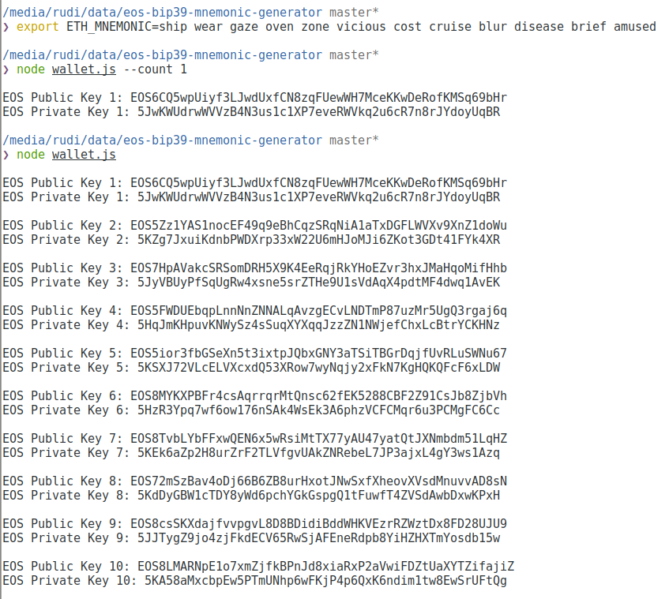

# eos-bip39-mnemonic-generator

EOS BIP39 Public/Private Key Generator

## Overview

At the time of this writing, EOS does not yet support BIP39 Mnemonic phrase for keys generation.

EOS BIP39 support is planned and upcoming, (see [here](https://github.com/EOSIO/eos/issues/3816)), for now a workaround is to:

1. Use a 12 word phrase to create Ethereum addresses
2. Convert those ETH address to EOS addresses.

The commandline node wallet.js script in this repo makes this simple and easy.

## References and Kudos

Thanks to:

1. pau1m from a web3 github issue [here](https://github.com/ethereum/web3.js/issues/1594)
2. miracle2k for this github gist [here](https://gist.github.com/miracle2k/3012de6f7bbc3b0d3f390d273c01bf89)
3. EOSCafe for their fallback method [here](https://github.com/eoscafe/eoskeyio)

## Install

1. `git clone https://github.com/rudijs/eos-bip39-mnemonic-generator.git`
2. `cd eos-bip39-mnemonic-generator`
3. `npm install`

## Usage

Export your 12 word mnemonic phrase to an environment variable named `ETH_MNEMONIC`.

If you don't have a 12 word phrase, check out [https://iancoleman.io/bip39/](https://iancoleman.io/bip39/) where you can generate one.

Example:

- `export ETH_MNEMONIC=ship wear gaze oven zone vicious cost cruise blur disease brief amused`

The default is set to create 10 EOS public/private keys, you can configure this with the `--count` flag.

Examples:

1. `node wallet.js`
2. `node wallet.js --count 1`

